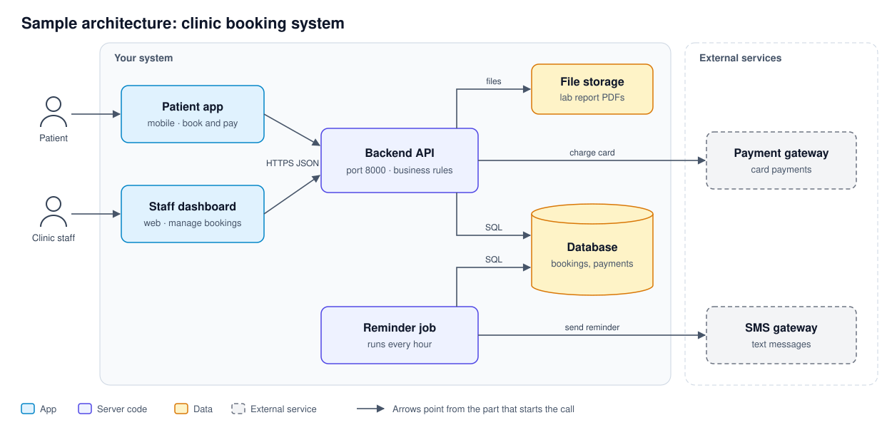

# Phase 3.2 — System Architecture Map

**Objective:** Show the parts of your system, what each one is responsible for, and how data moves between them. No application code yet; this is the plan.

**Status:** In Progress / Submitted · **Last updated:** [STUDENT INPUT: YYYY-MM-DD]

## Done When

- [ ] The diagram shows every part you will build or run, plus every external service from Phase 3.1
- [ ] The diagram displays on GitHub
- [ ] Every box in the diagram has a row in the component table
- [ ] One Must-Have flow is traced from start to finish, including what happens when a step fails

## 1. High-Level Component Map

Draw the parts you will actually build and run. Systems differ: besides an app and an API, yours might have a scheduled (cron) job, a data pipeline, a background worker or a machine learning model. Here is a sample for a clinic booking system; yours will look different.

Use any tool you like (for example draw.io, Excalidraw or Figma), label each arrow with what flows along it, export the diagram as a PNG into `context/assets/`, and embed it below. A Mermaid code block also works.

> [STUDENT INPUT: embed your diagram, e.g. ``]

## 2. Components

One row per box in your diagram.

| Component | Responsibility | Technology | Runs when | Talks to |
|---|---|---|---|---|
| [STUDENT INPUT: e.g. Backend API] | [STUDENT INPUT] | [STUDENT INPUT] | [STUDENT INPUT: e.g. on each HTTP request, port 8000] | [STUDENT INPUT: e.g. Database, payment service] |
| [STUDENT INPUT: e.g. Reminder job] | [STUDENT INPUT] | [STUDENT INPUT] | [STUDENT INPUT: e.g. every day at 02:00] | [STUDENT INPUT] |
| | | | | |

Where do secrets (database password, API keys, token secret) live, and which components can reach the database directly?

> [STUDENT INPUT: 2–3 sentences.]

## 3. Flow Trace

Pick one flow behind a Must-Have feature and trace it from what starts it (a user tap, a schedule, a new file) to the result someone sees. Along the way, note who is allowed to do it, what is checked, what is saved, and what happens if a step fails. Add or remove rows as needed.

Flow traced: [STUDENT INPUT: name, and the F-xx or UJ-xx it serves]

| Step | Where | What happens |
|---|---|---|
| 1 | [STUDENT INPUT: e.g. Client app] | [STUDENT INPUT: e.g. user taps Submit; app sends POST /api/v1/… with …] |
| 2 | [STUDENT INPUT] | [STUDENT INPUT] |
| 3 | | |
| 4 | | |
| 5 | | |
