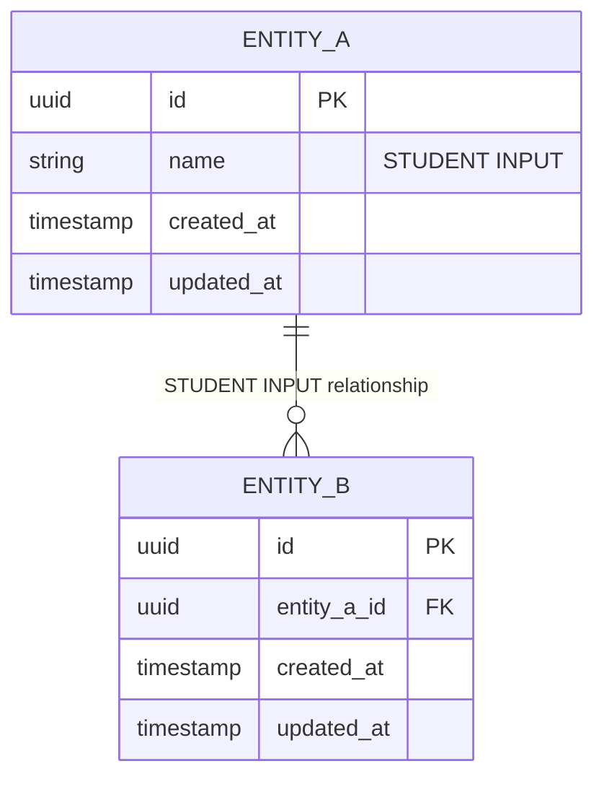

# Phase 3.3 — Database ERD

**Objective:** Design the data model your features need: every table, column, constraint and relationship, decided before any migration is written.

**Status:** In Progress / Submitted · **Last updated:** [STUDENT INPUT: YYYY-MM-DD]

## Done When

- [ ] The ERD covers every Must-Have feature and journey, and renders on GitHub
- [ ] Every table has a primary key and created/updated timestamps
- [ ] Every foreign key appears in the relationship table, with an on-delete rule
- [ ] No money columns use a floating-point type
- [ ] No fill-in markers left (the placeholder check prints nothing)

## 1. Conventions

- Table names are plural and in snake_case (e.g. `order_items`).
- Every table has a primary key `id`, plus `created_at` and `updated_at`.
- Money is stored as an integer in the smallest unit (e.g. cents), never as a float.
- Foreign keys are named `<entity>_id` and indexed.

If you use a document database such as MongoDB, describe collections and embedded documents in the same tables, and note which data is embedded and which is referenced.

## 2. Entity Relationship Diagram

Replace the two sample entities with all of yours.

## 3. Data Dictionary

Copy this table once for each table in your ERD.

### Table: [STUDENT INPUT: table_name]

| Column | Data type | Constraints | Nullable | Description |
|---|---|---|---|---|
| id | [STUDENT INPUT: e.g. uuid] | PRIMARY KEY | No | Unique identifier |
| [STUDENT INPUT] | [STUDENT INPUT] | [STUDENT INPUT: e.g. UNIQUE, CHECK > 0, FK → table.id] | [STUDENT INPUT] | [STUDENT INPUT] |
| created_at | timestamp | DEFAULT now | No | When the row was created |
| updated_at | timestamp | DEFAULT now | No | When the row was last changed |

## 4. Relationships & Foreign Keys

| Parent | Child | Cardinality | Foreign key | On delete | Business rule |
|---|---|---|---|---|---|
| [STUDENT INPUT] | [STUDENT INPUT] | [STUDENT INPUT: 1-to-many] | [STUDENT INPUT] | [STUDENT INPUT: CASCADE / RESTRICT / SET NULL] | [STUDENT INPUT] |
| | | | | | |
